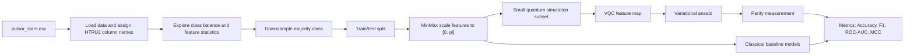
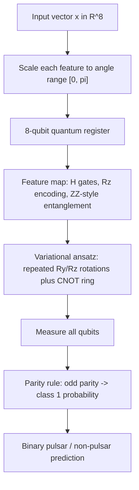
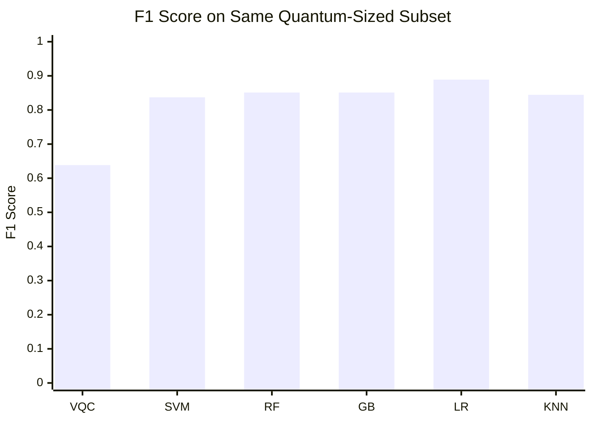
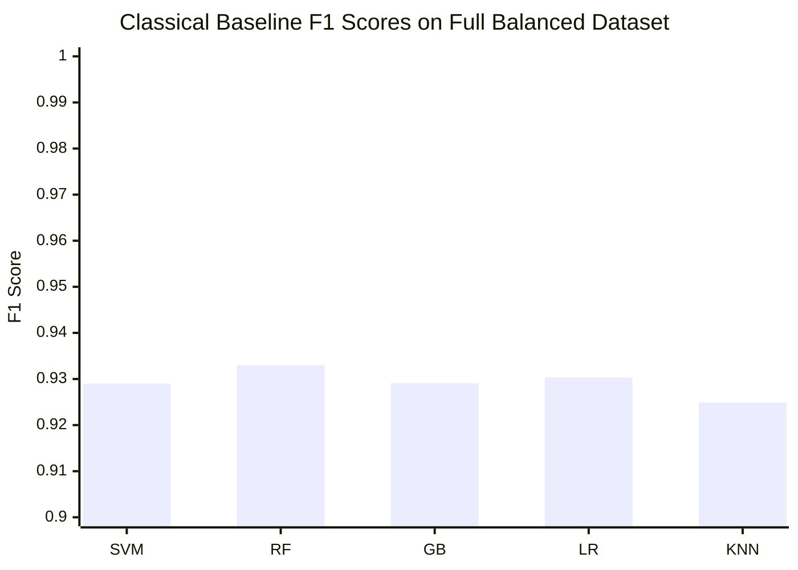

# Quantum Machine Learning and Optimization


This repository contains notebook experiments at the intersection of quantum
machine learning, quantum circuit primitives, and quantum-inspired optimization.
The main experiment trains a variational quantum classifier (VQC) on the HTRU2
pulsar candidate dataset, then compares the quantum model with classical
machine learning baselines.

## Project Highlights

- Variational quantum classifier for binary pulsar detection.
- Quantum feature encoding with an entangling feature map.
- Trainable variational ansatz with multi-qubit parity measurement.
- Classical baselines for fair side-by-side evaluation.
- SWAP test simulations for quantum state overlap estimation.
- Minimum vertex cover experiments with brute force, classical solvers, and
  D-Wave tooling.

## Repository Architecture

```text
Quantum-Machine-Learning/
|-- Variational_Quantum_Classifier.ipynb  # VQC training and evaluation
|-- Swap Test.ipynb                       # SWAP test circuit simulations
|-- min_vertex_cover.ipynb                # Quantum optimization experiments
|-- pulsar_stars.csv                      # HTRU2-style pulsar dataset
|-- requirements.txt                      # Python dependencies
|-- .gitattributes                        # Stable line-ending rules
|-- .gitignore                            # Local artifact exclusions
`-- README.md                             # Project documentation
```

## System Workflow



## VQC Architecture



## Mathematical Steps

### 1. Balanced Dataset Construction

The original dataset is imbalanced, with many more non-pulsar samples than
pulsar samples. The notebook creates a balanced dataset by retaining all pulsar
examples and randomly downsampling the non-pulsar class:

```math
D_{balanced} = D_{pulsar} \cup sample(D_{non-pulsar}, |D_{pulsar}|)
```

### 2. Feature Scaling

Each feature is scaled into the quantum rotation range:

```math
x'_j = \pi \cdot \frac{x_j - min(x_j)}{max(x_j) - min(x_j)}
```

The scaler is fit only on the training split to avoid data leakage.

### 3. Quantum Feature Map

For each feature angle `x_j`, the circuit applies a Hadamard gate and an `Rz`
encoding:

```math
|\psi(x)\rangle =
U_{\phi}(x)|0\rangle^{\otimes n}
```

The notebook then adds pairwise entanglement terms inspired by ZZ feature maps:

```math
R_z(2(\pi - x_i)(\pi - x_{i+1}))
```

### 4. Variational Ansatz

The trainable circuit has `L` layers. Each layer applies parameterized rotations
followed by a circular CNOT entangling pattern:

```math
U(\theta) = \prod_{\ell=1}^{L}
\left[
  U_{entangle}^{(\ell)}
  \prod_{j=1}^{n} R_z(\theta_{\ell,j,2}) R_y(\theta_{\ell,j,1})
\right]
```

### 5. Measurement and Prediction

All qubits are measured. The model uses parity as the decision observable:

```math
p(y=1|x,\theta) =
\sum_{z \in \{0,1\}^n}
\mathbb{1}[parity(z)=1]p(z|x,\theta)
```

The predicted class is:

```math
\hat{y} =
\begin{cases}
1, & p(y=1|x,\theta) \ge 0.5 \\
0, & otherwise
\end{cases}
```

### 6. Loss and Parameter-Shift Training

The notebook optimizes squared error:

```math
L(\theta) = (y - p(y=1|x,\theta))^2
```

Gradients are estimated with the parameter-shift rule:

```math
\frac{\partial f}{\partial \theta_i}
=
\frac{f(\theta_i + \pi/2) - f(\theta_i - \pi/2)}{2}
```

## Model Evaluation Snapshot

The quantum simulation is intentionally small because circuit simulation is
expensive. Classical models are evaluated both on the same small subset as the
VQC and on the full balanced dataset.

### Same Quantum-Sized Subset

| Model | Accuracy | Balanced Accuracy | Precision | Recall | F1 Score | ROC-AUC | MCC |
|---|---:|---:|---:|---:|---:|---:|---:|
| VQC | 0.5750 | 0.5614 | 0.6250 | 0.6522 | 0.6383 | 0.5448 | 0.1239 |
| SVM (RBF) | 0.8250 | 0.8325 | 0.9000 | 0.7826 | 0.8372 | 0.9233 | 0.6574 |
| Random Forest | 0.8250 | 0.8171 | 0.8333 | 0.8696 | 0.8511 | 0.9143 | 0.6400 |
| Gradient Boosting | 0.8250 | 0.8171 | 0.8333 | 0.8696 | 0.8511 | 0.8824 | 0.6400 |
| Logistic Regression | 0.8750 | 0.8760 | 0.9091 | 0.8696 | 0.8889 | 0.9233 | 0.7472 |
| K-Nearest Neighbors | 0.8250 | 0.8248 | 0.8636 | 0.8261 | 0.8444 | 0.9309 | 0.6455 |



### Full Balanced Dataset Baselines

| Model | Accuracy | Balanced Accuracy | Precision | Recall | F1 Score | ROC-AUC | MCC |
|---|---:|---:|---:|---:|---:|---:|---:|
| SVM (RBF) | 0.9329 | 0.9329 | 0.9863 | 0.8780 | 0.9290 | 0.9697 | 0.8711 |
| Random Forest | 0.9360 | 0.9360 | 0.9777 | 0.8923 | 0.9330 | 0.9680 | 0.8753 |
| Gradient Boosting | 0.9319 | 0.9319 | 0.9691 | 0.8923 | 0.9291 | 0.9728 | 0.8665 |
| Logistic Regression | 0.9339 | 0.9339 | 0.9841 | 0.8821 | 0.9303 | 0.9671 | 0.8726 |
| K-Nearest Neighbors | 0.9278 | 0.9278 | 0.9647 | 0.8882 | 0.9249 | 0.9604 | 0.8584 |



## Notebook Guide

### Variational Quantum Classifier

Use this notebook for the full machine learning pipeline:

1. Load and inspect the pulsar dataset.
2. Visualize class balance and feature distributions.
3. Create a balanced dataset.
4. Scale features for quantum rotations.
5. Build and print the VQC circuit.
6. Train the VQC with parameter-shift gradients.
7. Evaluate quantum and classical models.

### SWAP Test

Use this notebook to study how depolarizing noise affects SWAP test estimates
of state overlap. The notebook builds circuits for multiple input dimensions and
plots the probability of measuring the all-zero ancilla outcome.

### Minimum Vertex Cover

Use this notebook to compare optimization strategies for a graph problem:

- Erdos-Renyi graph generation.
- Exact and brute-force classical solving.
- D-Wave Ocean tooling for quantum annealing experiments.
- Visual comparison of cover sizes across graph sizes.

## Installation

```bash
python3 -m venv .venv
source .venv/bin/activate
pip install -r requirements.txt
```

Launch Jupyter:

```bash
jupyter notebook
```

## Reproducibility Notes

- The VQC notebook uses fixed random seeds in the main preprocessing and
  training sections.
- The dataset file has no header row; the notebook assigns feature names during
  loading.
- Quantum simulation runtime grows quickly with more qubits, samples, shots, and
  training epochs.
- D-Wave notebook sections may require configured D-Wave Ocean credentials.

## Future Improvements

- Add automated notebook execution checks with `nbmake` or `papermill`.
- Export plots from notebooks into versioned `assets/` images.
- Add environment files for CPU-only and quantum-hardware-backed workflows.
- Modernize older Qiskit imports in the SWAP test notebook for current Qiskit
  releases.
