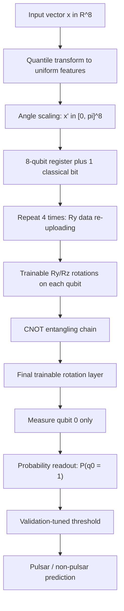
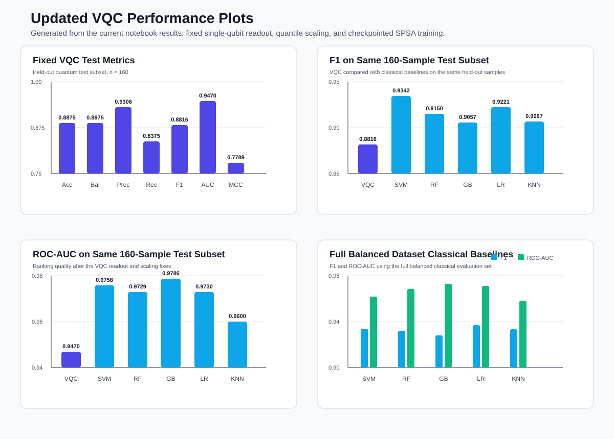

# Quantum Machine Learning and Optimization


This repository contains notebook experiments in quantum machine learning,
quantum circuit primitives, and quantum-inspired optimization. The main
experiment trains a variational quantum classifier (VQC) for pulsar candidate
detection on the HTRU2-style dataset and compares it with strong classical
machine learning baselines.

The VQC notebook was updated after diagnosing why the earlier classifier did
not learn: the old normalized Hamming-weight readout after a deep ZZ-style
feature map concentrated predictions around 0.5. The current implementation
uses quantile-based feature scaling, a lightweight data re-uploading circuit,
single-qubit readout, checkpointed SPSA training, and validation-tuned
thresholding.

## Current VQC Snapshot

| Item | Current implementation |
|---|---|
| Task | Binary pulsar vs non-pulsar classification |
| Dataset handling | Balanced by downsampling the majority class |
| Quantum subset | 160 train, 160 validation, 160 held-out test samples |
| Feature scaling | `QuantileTransformer(output_distribution="uniform")`, then scaled to `[0, pi]` |
| Circuit | 8 qubits, 4 data re-uploading blocks, 80 trainable parameters |
| Readout | Single measured qubit: `P(q0 = 1)` |
| Optimizer | SPSA, 300 steps, batch size 16 |
| Shots | 1024 during training, 4096 during final evaluation |
| Current VQC test F1 | `0.8816` |
| Current VQC ROC-AUC | `0.9470` |

## Project Highlights

- Fixed VQC pipeline for binary pulsar detection.
- Quantile scaling for heavily skewed HTRU2 features.
- Data re-uploading ansatz with `Ry` feature encoding and trainable `Ry/Rz`
  rotations.
- Single-qubit probability readout that avoids Hamming-weight concentration.
- Batched Qiskit Aer circuit execution for faster simulation.
- Checkpointed SPSA training with binary cross-entropy loss.
- Validation-selected decision threshold for better F1 performance.
- Classical baselines on both the quantum-sized subset and the full balanced
  dataset.
- SWAP test simulations for quantum state overlap estimation.
- Minimum vertex cover experiments with brute force, classical solvers, and
  D-Wave tooling.

## Repository Architecture

```text
Quantum-Machine-Learning/
|-- Variational_Quantum_Classifier.ipynb  # Fixed VQC pipeline and evaluation
|-- Swap Test.ipynb                       # SWAP test circuit simulations
|-- min_vertex_cover.ipynb                # Quantum optimization experiments
|-- pulsar_stars.csv                      # HTRU2-style pulsar dataset
|-- requirements.txt                      # Python dependencies
|-- .gitattributes                        # Stable line-ending rules
|-- .gitignore                            # Local artifact exclusions
`-- README.md                             # Project documentation
```

Generated during VQC runs:

```text
vqc_checkpoint.npz  # SPSA checkpoint with theta, step, and evaluation history
```

Keep `vqc_checkpoint.npz` to resume or skip completed VQC training. Delete it
only when you want to retrain the VQC from scratch.

## System Workflow


## VQC Architecture



## Why The VQC Improved

| Previous issue | Effect | Current fix |
|---|---|---|
| Deep ZZ-style feature map | Expressive circuit made outputs concentrate | Lightweight `Ry` angle encoding with data re-uploading |
| Hamming-weight readout over all 8 qubits | Predictions stayed near 0.5 | Single-qubit readout with full `[0, 1]` range |
| MinMax scaling on skewed features | Most angles were squashed together | Quantile transform spreads each feature uniformly |
| Random wide initialization | Circuit could start in saturated regions | Small near-identity initialization |
| Per-circuit execution | Slow training loop | Batched backend execution |

The notebook reports that the old readout produced nearly constant class means
around 0.5. With the current changes, the VQC reaches F1 `0.8816` on the
160-sample held-out quantum test subset.

## Mathematical Steps

### 1. Balanced Dataset Construction

The original dataset is imbalanced, with many more non-pulsar samples than
pulsar samples. The notebook keeps all pulsar examples and randomly downsamples
the non-pulsar class:

```math
D_{balanced} = D_{pulsar} \cup sample(D_{non-pulsar}, |D_{pulsar}|)
```

### 2. Leak-Free Quantile Scaling

The quantile transformer is fit only on the training side of the split and then
reused for validation and test data:

```math
u_j = Q_j(x_j), \quad u_j \in [0, 1]
```

Each transformed feature is mapped to a quantum rotation angle:

```math
x'_j = \pi u_j
```

This is important because several HTRU2 features are highly skewed. Quantile
scaling spreads the useful signal across the available rotation range more
effectively than MinMax scaling.

### 3. Data Re-Uploading Circuit

For each layer, the current VQC re-encodes the input and then applies trainable
rotations:

```math
U_{layer}^{(\ell)}(x', \theta) =
U_{entangle}
\prod_{j=1}^{n}
R_z(\theta_{\ell,j,2})R_y(\theta_{\ell,j,1})R_y(x'_j)
```

The full model uses four re-uploading blocks followed by a final trainable
rotation layer:

```math
U(x', \theta) =
U_{final}(\theta)
\prod_{\ell=1}^{L} U_{layer}^{(\ell)}(x', \theta)
```

where `n = 8`, `L = 4`, and the current parameter count is:

```math
(L + 1) \times 2n = 80
```

### 4. Measurement and Prediction

Only qubit 0 is measured. The model probability is:

```math
p(y=1 | x, \theta) = P(c_0 = 1 | x, \theta)
```

The predicted class uses a validation-selected threshold `tau`:

```math
\hat{y} =
\begin{cases}
1, & p(y=1|x,\theta) \ge \tau \\
0, & otherwise
\end{cases}
```

The current validation-selected threshold is:

```math
\tau = 0.550
```

### 5. Loss and SPSA Training

The VQC optimizes binary cross-entropy:

```math
\mathcal{L}(\theta) =
-\frac{1}{m}\sum_{i=1}^{m}
\left[
y_i\log(p_i) + (1-y_i)\log(1-p_i)
\right]
```

SPSA estimates a gradient from two mini-batch loss evaluations:

```math
\hat{g}_k =
\frac{\mathcal{L}(\theta_k + c_k\Delta_k) -
\mathcal{L}(\theta_k - c_k\Delta_k)}
{2c_k}\Delta_k
```

The parameters are updated as:

```math
\theta_{k+1} = \theta_k - a_k\hat{g}_k
```

The notebook saves `vqc_checkpoint.npz` after each SPSA step so interrupted
training can resume from the latest parameters.

## Model Evaluation Snapshot

Quantum simulation is intentionally run on a small balanced subset because
shot-based circuit simulation becomes expensive as samples, shots, qubits, and
optimizer steps increase. Classical models are evaluated both on the same
160-sample held-out test subset and on the full balanced dataset.

Updated plots from the current notebook metrics:



### Same Quantum-Sized Test Subset

| Model | Accuracy | Balanced Accuracy | Precision | Recall | F1 Score | ROC-AUC | MCC |
|---|---:|---:|---:|---:|---:|---:|---:|
| VQC, fixed readout | 0.8875 | 0.8875 | 0.9306 | 0.8375 | 0.8816 | 0.9470 | 0.7789 |
| SVM (RBF) | 0.9375 | 0.9375 | 0.9861 | 0.8875 | 0.9342 | 0.9758 | 0.8794 |
| Random Forest | 0.9188 | 0.9188 | 0.9589 | 0.8750 | 0.9150 | 0.9729 | 0.8407 |
| Gradient Boosting | 0.9062 | 0.9062 | 0.9114 | 0.9000 | 0.9057 | 0.9786 | 0.8126 |
| Logistic Regression | 0.9250 | 0.9250 | 0.9595 | 0.8875 | 0.9221 | 0.9730 | 0.8524 |
| K-Nearest Neighbors | 0.9125 | 0.9125 | 0.9714 | 0.8500 | 0.9067 | 0.9600 | 0.8315 |

VQC confusion matrix on the same test subset:

```text
Rows: true class, columns: predicted class
[[75  5]
 [13 67]]
```

### Full Balanced Dataset Baselines

The VQC is not run on the full balanced dataset because the notebook keeps the
quantum simulation deliberately small. These full-dataset results show the
classical ceiling for the current preprocessing setup.

| Model | Accuracy | Balanced Accuracy | Precision | Recall | F1 Score | ROC-AUC | MCC |
|---|---:|---:|---:|---:|---:|---:|---:|
| SVM (RBF) | 0.9370 | 0.9370 | 0.9821 | 0.8902 | 0.9339 | 0.9618 | 0.8778 |
| Random Forest | 0.9350 | 0.9350 | 0.9777 | 0.8902 | 0.9319 | 0.9685 | 0.8734 |
| Gradient Boosting | 0.9309 | 0.9309 | 0.9690 | 0.8902 | 0.9280 | 0.9728 | 0.8647 |
| Logistic Regression | 0.9390 | 0.9390 | 0.9716 | 0.9045 | 0.9368 | 0.9710 | 0.8802 |
| K-Nearest Neighbors | 0.9360 | 0.9360 | 0.9756 | 0.8943 | 0.9332 | 0.9584 | 0.8750 |

### Cross-Validation Baseline Check

| Model | Mean CV F1 | Std |
|---|---:|---:|
| SVM (RBF) | 0.9470 | 0.0085 |
| Random Forest | 0.9473 | 0.0068 |
| Gradient Boosting | 0.9415 | 0.0106 |
| Logistic Regression | 0.9413 | 0.0094 |
| K-Nearest Neighbors | 0.9403 | 0.0099 |

## Notebook Guide

### Variational Quantum Classifier

Use this notebook for the complete VQC machine learning pipeline:

1. Load the HTRU2-style pulsar dataset.
2. Inspect class balance and feature distributions.
3. Create a balanced dataset by downsampling the majority class.
4. Fit the quantile transformer on training data only.
5. Build and print the VQC circuit for inspection.
6. Train the VQC with checkpointed SPSA and binary cross-entropy.
7. Select the decision threshold using validation F1.
8. Evaluate the VQC with accuracy, balanced accuracy, precision, recall, F1,
   ROC-AUC, MCC, and a confusion matrix.
9. Compare against classical baselines on the same subset and full balanced
   data.

### SWAP Test

Use this notebook to study how depolarizing noise affects SWAP test estimates
of state overlap. The notebook builds circuits for multiple input dimensions and
plots the probability of measuring the all-zero ancilla outcome.

### Minimum Vertex Cover

Use this notebook to compare optimization strategies for a graph problem:

- Erdos-Renyi graph generation.
- Exact and brute-force classical solving.
- D-Wave Ocean tooling for quantum annealing experiments.
- Visual comparison of cover sizes across graph sizes.

## Installation

```bash
python3 -m venv .venv
source .venv/bin/activate
pip install -r requirements.txt
```

Launch Jupyter:

```bash
jupyter notebook
```

## Reproducibility Notes

- The VQC notebook uses fixed random seeds for preprocessing, subset selection,
  initialization, and SPSA perturbations.
- The dataset file has no header row; the notebook assigns HTRU2 feature names
  during loading.
- The quantile transformer is fit on training data only to prevent leakage.
- The VQC uses balanced 160/160/160 train, validation, and test subsets.
- Final VQC metrics use 4096 shots per circuit to reduce readout noise.
- `vqc_checkpoint.npz` is generated during training. Keep it to resume; delete
  it to retrain from step 1.
- Quantum simulation runtime grows quickly with more qubits, samples, shots, and
  SPSA steps.
- D-Wave notebook sections may require configured D-Wave Ocean credentials.

